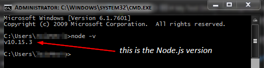

# My Test Driven Development Repository

Test-driven development (TDD) is a software development process relying on software requirements being converted to test cases before software is fully developed, and tracking all software development by repeatedly testing the software against all test cases.

I am glad to share a few of my works in TDD through this repository. Each task or project is placed in its own folder.  Each folder contains all the necessary files to run a particular project.

### **System requirements:**
To be able to test smoothly these projects, the following apps must be **present or installed** in your system:
* Visual Studio Code (v1.54.3 or latest)
    * download link: [Click here](https://code.visualstudio.com/download)
* Node.js (v10.15.3 or latest)
    * download link: [Click here](https://nodejs.org/en/download/)

To check the presence of **Node.js** in your system, open a **DOS Command Window** and type this command:
```
node -v
```
The installed version of Node.js will be displayed as per attached image.



In case you want to know how to get into the Command Prompt in Windows 7 or Windows 10, follow these steps:
1. Click **`Start`** button.
2. Type **`cmd`** and **press Enter**.

Finally, these are the steps to run the test:
1. Download the folder you want to test and open it with Visual Studio Code.
2. Open a terminal panel from `View` menu and select `Terminal`. If you have a `bash.exe` or `powershell.exe` as the terminal integrated shell, it is fine.
3. To run the test, type this command in the terminal panel and press Enter: 
```
npm test
```

## Sample screenshot, test run for `sumTriOdd` project.


To exit from the running test and return to the prompt, press `Ctrl+C` 

Thank you for reading. Cheers!
* * *
#### Codewars Status: 
